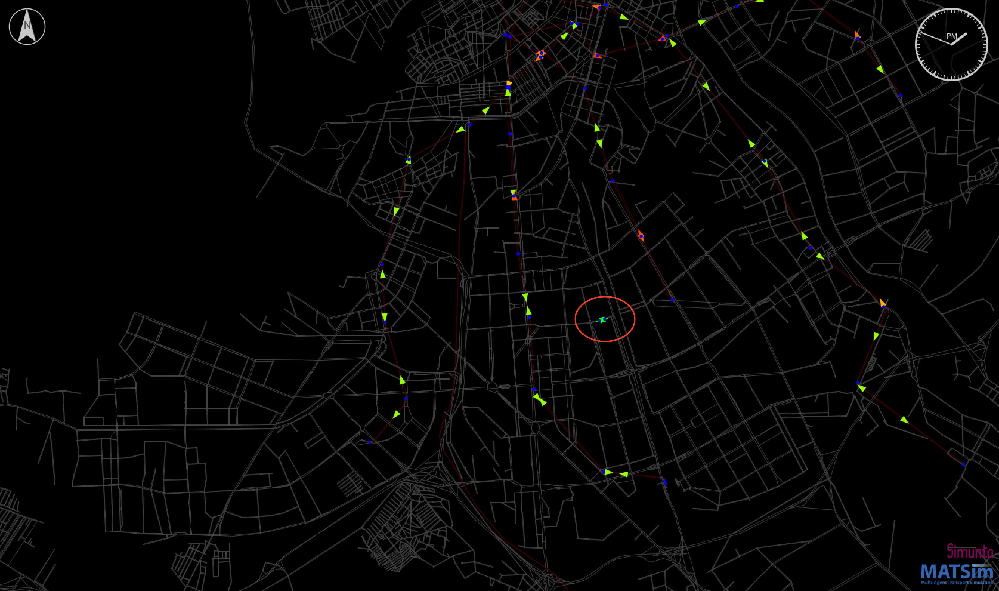

# Запуск minibus для Санкт-Петербурга

1. Запуск примерно для Кировского + Московского районов, потому что только для Кировского района не создаётся ни одной
    остановки.
    <param name="minX" value="676000.0" />
    <param name="maxX" value="688000.0" />
    <param name="minY" value="6636000.0" />
    <param name="maxY" value="6646000.0" />
    Я думаю, неправильно настроен config.xml. Он взят из сетки 4 на 4 из статьи Неймана.

2. Запуск 100 % от population.xml
    
    Результат в `output/spb_output_100percent`
    
    Ошибка на итерации it.0:
    `<Exception in thread "main" java.lang.NullPointerException
        at org.matsim.contrib.minibus.stats.ActivityLocationsParatransitUser.parsePopulation(ActivityLocationsParatransitUser.java:135)>`
    
    В каких-то планах у *Leg* отсутствует *Route* (= null).

3. Запуск 10 % от population.xml
        `<removePercentOfPopulation(scenario.getPopulation(), 90);>`
        
    Результат в `output/spb_output_10percent`
    
    После 100 итераций создаются только 2 рядом рассположенные остановки, на которых работает 10 операторов
    
    Я думаю, неправильно настроен config.xml.

**Результат: пока не получается получить результат.**

